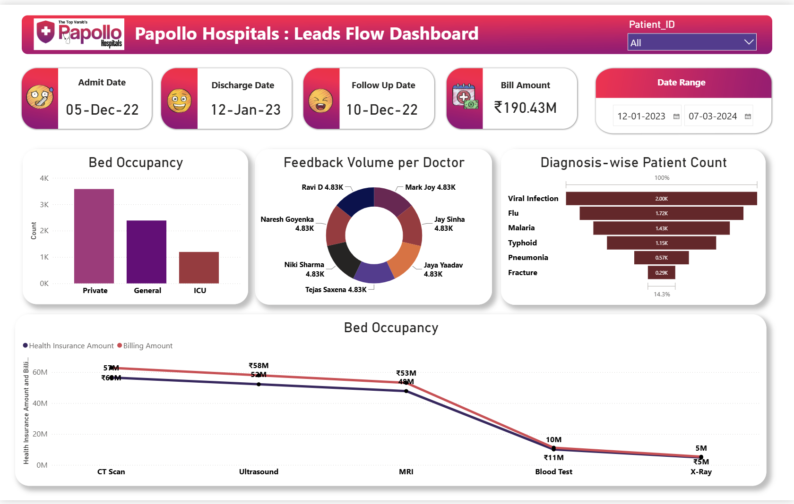

# Aapollo-hospitals-power-bi-dashboard

Power BI healthcare analytics dashboard analyzing patient admissions, bed occupancy, diagnoses, doctor feedback, billing, and insurance data.
Papollo Hospitals – Healthcare Analytics Dashboard

## Project Overview
An interactive Power BI dashboard created to analyze hospital data and provide insights into patient admissions, bed occupancy, diagnoses, doctor feedback, billing, and insurance amounts.

## Tools Used

- Power BI
- Power Query
- DAX
- Data Cleaning & Transformation
- Data Visualization

## Key Insights

- Analyzed patient count by diagnosis.
- Compared bed occupancy across different categories.
- Analyzed doctor-wise feedback volume.
- Compared billing and health insurance amounts.
- Used filters for Patient ID and Date Range.

## Dashboard Preview

##  Author

**Jay Kumar Raj**  
Aspiring Data Analyst

**Skills:** SQL | Excel | Power BI | Python
